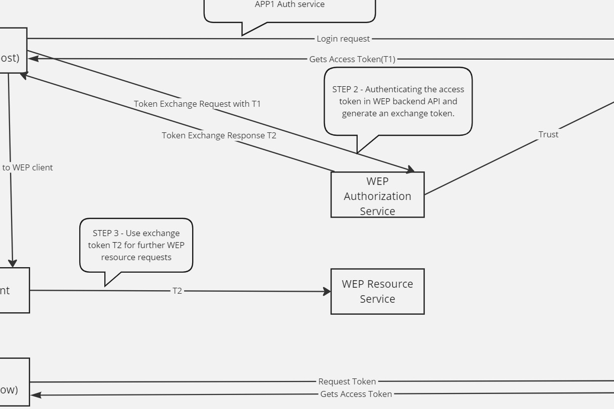

# WEP-Auth-POC

Server API projects are using ASP.NET Core 8 and client side is using Angular 15.

Steps
----------
1. Inside client folder open the AuthIntegratedApp folder and open cmd from the current path. Run npm install to add necessary packages.
2. Repeat Step1 inside the client/sampleauthapp-client.
3. Run both API projects inside the server folder.
4. Run client apps with the command 'ng serve'. Make sure AuthIntegratedApp runs under port 4200 and sampleauthapp runs under port 4201.
5. Enter user credentials 'sreejith' as username and 'abc' as password for login to sampleauthapp.