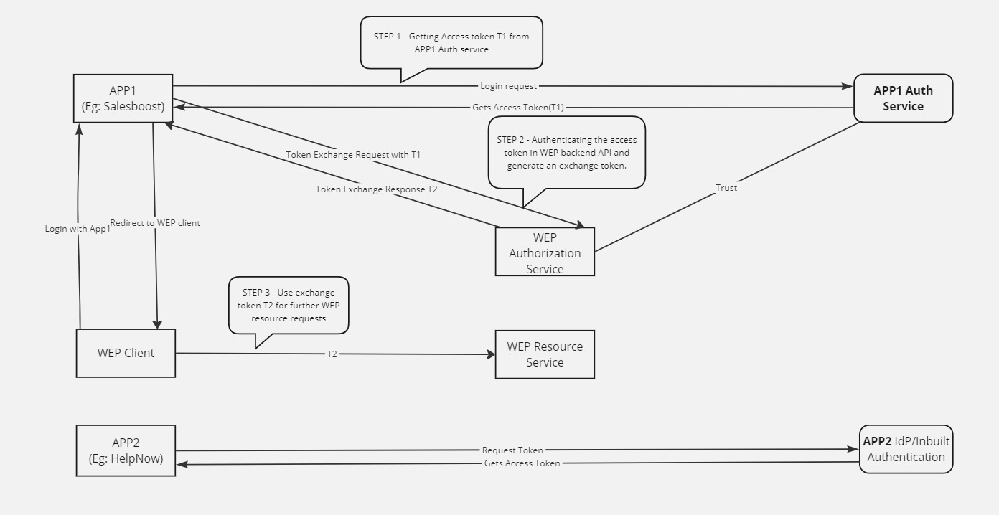

# WEP-Auth-POC

Server API projects are using ASP.NET Core 8 and client side is using Angular 15.

Steps
----------
1. For App1 and WEP client run the npm install command and execute ng serve. Make sure App1 client runs under port 4200 and WEP client runs under port 4201.
2. Run App1 and WEP API server. WEP has a IdentityServer and a Resource API.
3. In App1, enter inmemory credentials configured - 'alice' as username and 'Abcd@1234' as password.